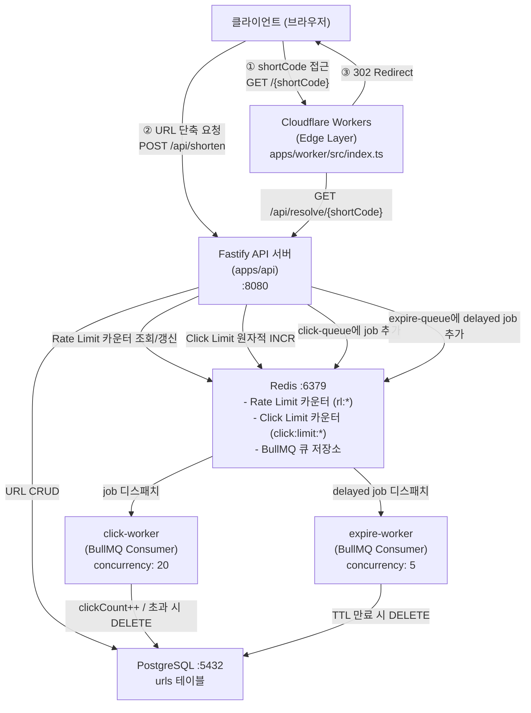

# 01. 전체 아키텍처

## 컴포넌트 다이어그램



---

## 레이어 구조

```
Cloudflare Workers (Edge)
        ↓
  [Route Layer]           apps/api/src/routes/url.route.ts
        ↓
  [Service Layer]         apps/api/src/services/url.service.ts
        ↓
  [Repository Layer]      apps/api/src/repositories/url.repository.ts
        ↓
  [Database (Prisma)]     PostgreSQL
```

| 레이어 | 파일 | 역할 |
|--------|------|------|
| Edge | `apps/worker/src/index.ts` | shortCode 추출, API 호출, 302 리다이렉트 생성 |
| Route | `apps/api/src/routes/url.route.ts` | HTTP 요청 파싱, 응답 직렬화, Rate Limit 설정 |
| Service | `apps/api/src/services/url.service.ts` | 비즈니스 로직 (shortCode 생성, 만료 판단, 큐 발행) |
| Repository | `apps/api/src/repositories/url.repository.ts` | Prisma를 통한 DB 접근 추상화 |
| Worker | `apps/api/src/workers/*.ts` | BullMQ Consumer — 비동기 클릭 집계 / TTL 삭제 |

---

## 외부 의존성 목록

| 의존성 | 연동 방식 | 역할 |
|--------|-----------|------|
| PostgreSQL | Prisma (adapter-pg) via `DATABASE_URL` | URL 데이터 영구 저장 |
| Redis | ioredis via `REDIS_HOST` / `REDIS_PORT` | Rate Limit 카운터, Click Limit 원자 카운터, BullMQ 백엔드 |
| Cloudflare Workers | wrangler 배포, `API_BASE_URL` 환경변수로 API 연결 | Edge 리다이렉트 처리 |

---

## 설계 포인트

- **Edge에서 리다이렉트 처리**: 브라우저 접근은 CF Workers가 받아서 `/api/resolve/:shortCode` API를 호출한 뒤 직접 302를 반환. 이로써 CF의 글로벌 엣지 PoP에서 리다이렉트가 이루어짐.
- **비동기 클릭 집계**: 클릭 이벤트는 `clickQueue`에 즉시 발행 후 응답을 반환. DB `clickCount` 갱신은 worker가 비동기로 처리하여 응답 레이턴시 최소화.
- **원자적 Click Limit 체크**: Redis `INCR`로 레이스 컨디션 없이 clickLimit 초과 방지 (근거: `apps/api/src/services/url.service.ts:117`).
- **fail-open Rate Limit**: Redis 장애 시 Rate Limit을 통과시킴 (`skipOnError: true`) — 가용성 우선 설계.
