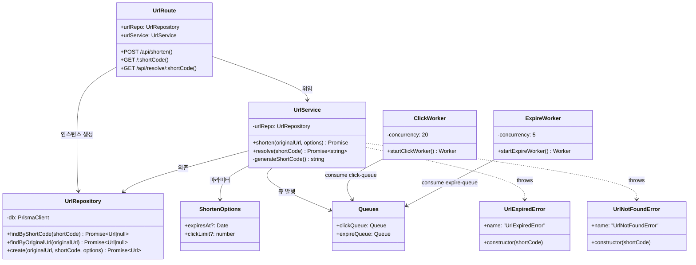
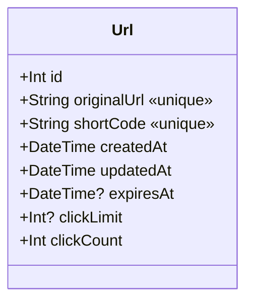

# 02. 클래스 다이어그램 (도메인 모델)

## URL 도메인

---

## 주요 클래스 책임 요약

| 클래스 / 모듈 | 위치 | 책임 |
|---------------|------|------|
| `UrlRoute` | `routes/url.route.ts` | HTTP 요청 수신, 입력 검증, 응답 반환 및 Rate Limit 설정 |
| `UrlService` | `services/url.service.ts` | shortCode 생성(Base62 7자리), 중복/충돌 처리, 만료 판단, 큐 발행 |
| `UrlRepository` | `repositories/url.repository.ts` | Prisma Client를 래핑한 DB 접근 전용 계층 |
| `ClickWorker` | `workers/click.worker.ts` | `click-queue` 소비 → DB `clickCount` 증가 → 한도 초과 시 레코드 삭제 |
| `ExpireWorker` | `workers/expire.worker.ts` | `expire-queue` delayed job 소비 → TTL 만료 확인 후 레코드 삭제 |

---

## Prisma 모델 (DB 엔티티)

| 필드 | 타입 | 의미 |
|------|------|------|
| `originalUrl` | `String UNIQUE` | 원본 URL — 중복 단축 방지용 unique 제약 |
| `shortCode` | `String UNIQUE` | Base62 7자리 단축 코드 |
| `expiresAt` | `DateTime?` | `null` = 무기한. TTL 기반 만료 시각 |
| `clickLimit` | `Int?` | `null` = 무제한. 횟수 기반 만료 한도 |
| `clickCount` | `Int DEFAULT 0` | 현재까지 클릭된 횟수 |

---

## 핵심 에러 타입

| 에러 클래스 | 발생 조건 | HTTP 응답 |
|-------------|-----------|-----------|
| `UrlNotFoundError` | shortCode가 DB에 없음 | 404 |
| `UrlExpiredError` | `expiresAt` 초과 또는 `clickLimit` 초과 | 410 |

> 근거: `apps/api/src/errors.ts`, `apps/api/src/routes/url.route.ts:55-59`
