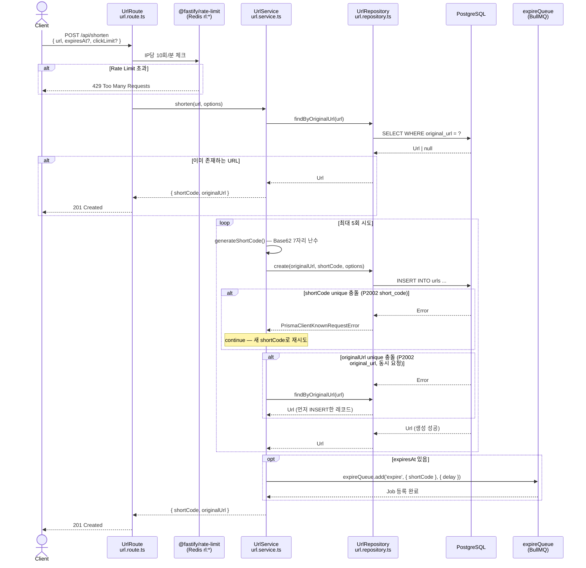
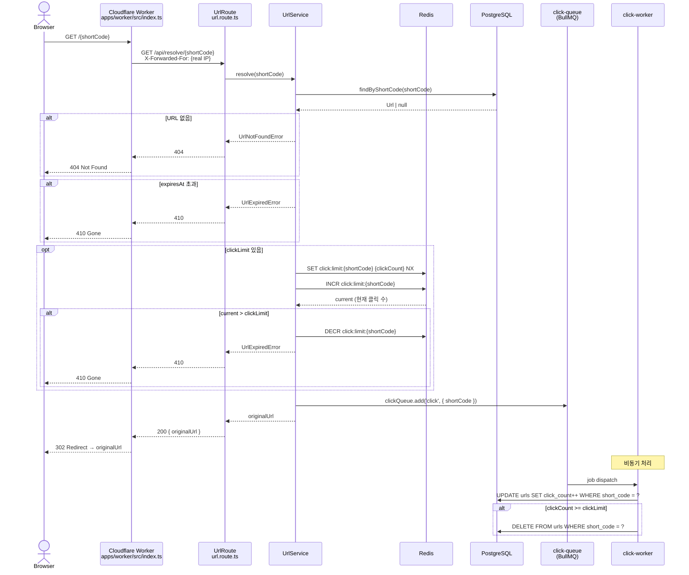
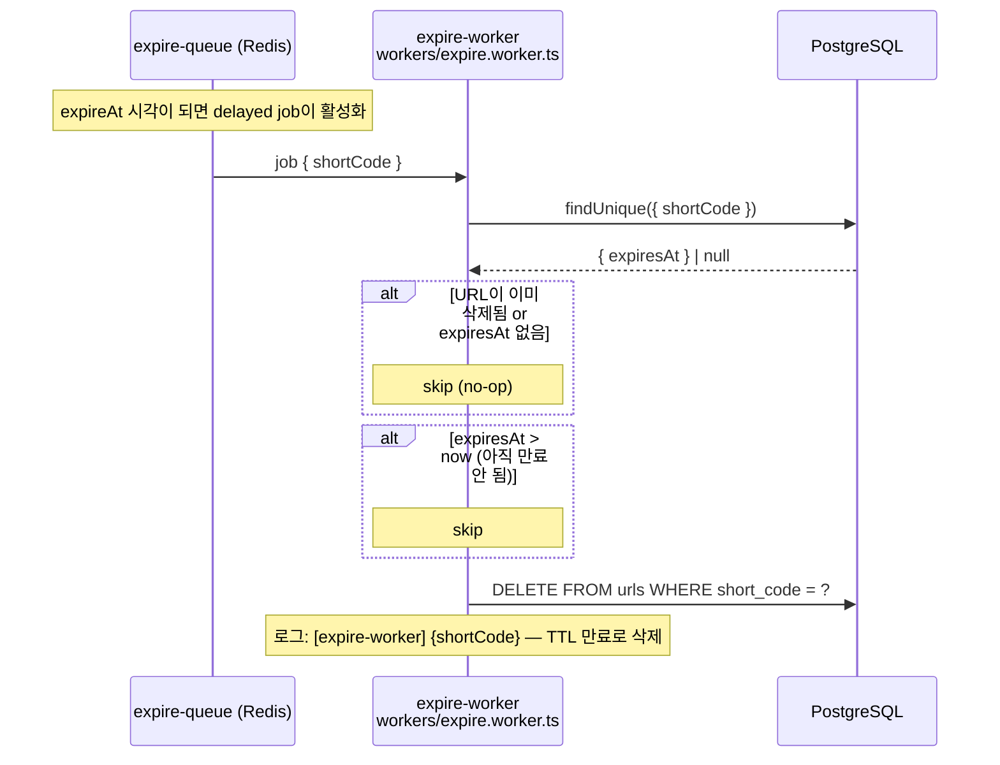
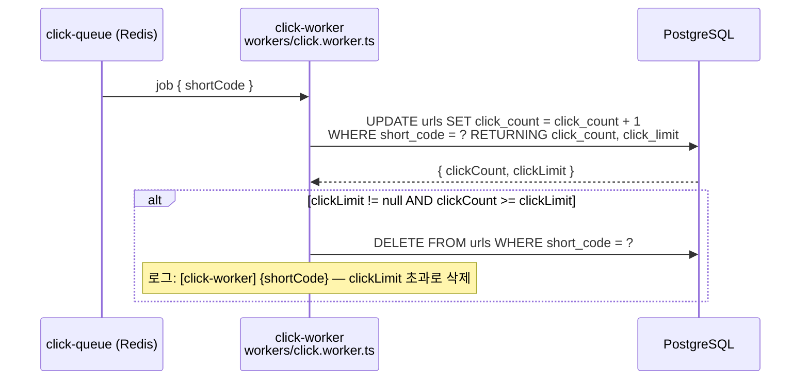

# 03. 시퀀스 다이어그램 (핵심 플로우)

## 시나리오 1: URL 단축 (POST /api/shorten)

**핵심 파일/메서드 매핑**

| 단계 | 파일 | 메서드 / 라인 |
|------|------|---------------|
| 라우트 진입 | `routes/url.route.ts` | `app.post('/api/shorten', ...)` L13 |
| 서비스 호출 | `services/url.service.ts` | `UrlService.shorten()` L25 |
| 기존 URL 확인 | `repositories/url.repository.ts` | `findByOriginalUrl()` L12 |
| shortCode 생성 | `services/url.service.ts` | `generateShortCode()` L9 |
| DB 삽입 | `repositories/url.repository.ts` | `create()` L15 |
| expire 큐 등록 | `queues/index.ts` | `expireQueue.add(...)` / `url.service.ts` L64 |

---

## 시나리오 2: URL 리다이렉트 (브라우저 직접 접근)

**핵심 파일/메서드 매핑**

| 단계 | 파일 | 메서드 / 라인 |
|------|------|---------------|
| CF Worker 진입 | `apps/worker/src/index.ts` | `fetch()` handler L6 |
| API 호출 | `apps/worker/src/index.ts` | `fetch(apiUrl, ...)` L29 |
| 라우트 | `routes/url.route.ts` | `GET /api/resolve/:shortCode` L68 |
| 서비스 | `services/url.service.ts` | `UrlService.resolve()` L105 |
| Redis INCR | `services/url.service.ts` | `redisConnection.incr(key)` L131 |
| 큐 발행 | `services/url.service.ts` | `clickQueue.add(...)` L140 |
| Worker 소비 | `workers/click.worker.ts` | `startClickWorker()` L9 |

---

## 시나리오 3: TTL 만료 삭제 (Delayed Job)

---

## 시나리오 4: Click Limit 초과 삭제 (클릭 Worker)

