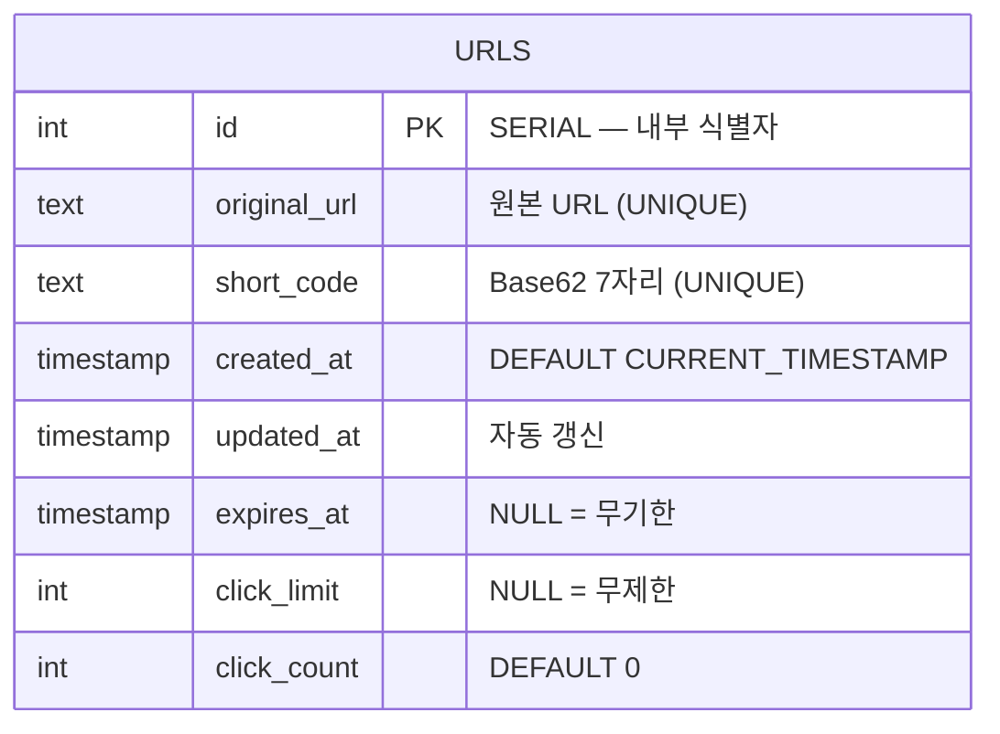
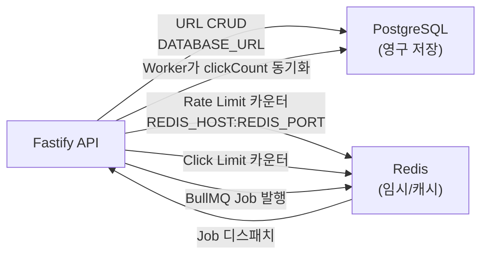

# 04. 데이터 모델 / DB 스키마

## ER 다이어그램

현재 단일 테이블 구조. 별도의 관계(FK)는 없음.

---

## 마이그레이션 이력

| 순서 | 파일명 | 변경 내용 |
|------|--------|-----------|
| 1 | `20260222115924_init` | `urls` 테이블 생성, `short_code` UNIQUE 인덱스 |
| 2 | `20260223120427_add_expiration_fields` | `click_count`, `click_limit`, `expires_at` 컬럼 추가 |
| 3 | `20260420132526_add_unique_original_url` | `original_url` UNIQUE 인덱스 추가 (중복 단축 방지 및 race condition 처리용) |

> 근거: `apps/api/prisma/migrations/` 하위 3개 SQL 파일

---

## 인덱스 현황

| 인덱스 | 대상 컬럼 | 용도 |
|--------|-----------|------|
| `urls_pkey` | `id` | PK |
| `urls_short_code_key` | `short_code` | 리다이렉트 조회 (`findByShortCode`) |
| `urls_original_url_key` | `original_url` | 중복 단축 방지 + 동시 INSERT 충돌 감지 |

---

## Redis 데이터 구조

Redis는 DB가 아닌 **캐시 및 큐 백엔드**로 활용. 아래 키 패턴이 존재한다.

| 키 패턴 | 타입 | 용도 | TTL |
|---------|------|------|-----|
| `rl:{ip}:{route}` | String (카운터) | Rate Limit 카운터 (네임스페이스 `rl:`) | 1분 |
| `click:limit:{shortCode}` | String (카운터) | Click Limit 원자적 체크 | 24시간 또는 `expiresAt`까지 |
| `bull:click-queue:*` | Hash / ZSet / List | BullMQ 내부 구조 (클릭 이벤트 큐) | job 완료 후 자동 정리 |
| `bull:expire-queue:*` | Hash / ZSet / List | BullMQ 내부 구조 (TTL 만료 delayed job) | job 완료 후 자동 정리 |

> 근거: `apps/api/src/services/url.service.ts:119-128`, `apps/api/src/index.ts:22` (nameSpace: `rl:`), `apps/api/src/queues/index.ts`

---

## 외부 데이터 소스 연동 흐름

